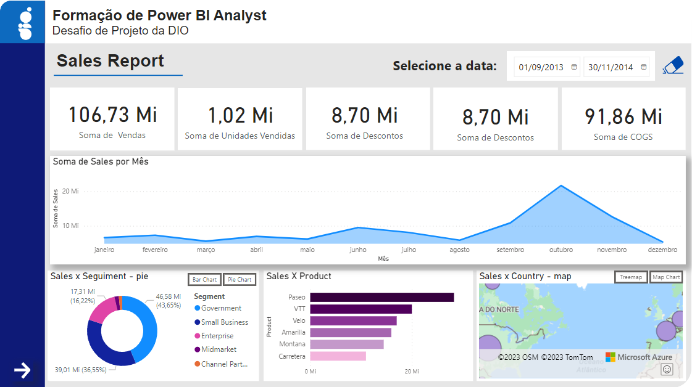
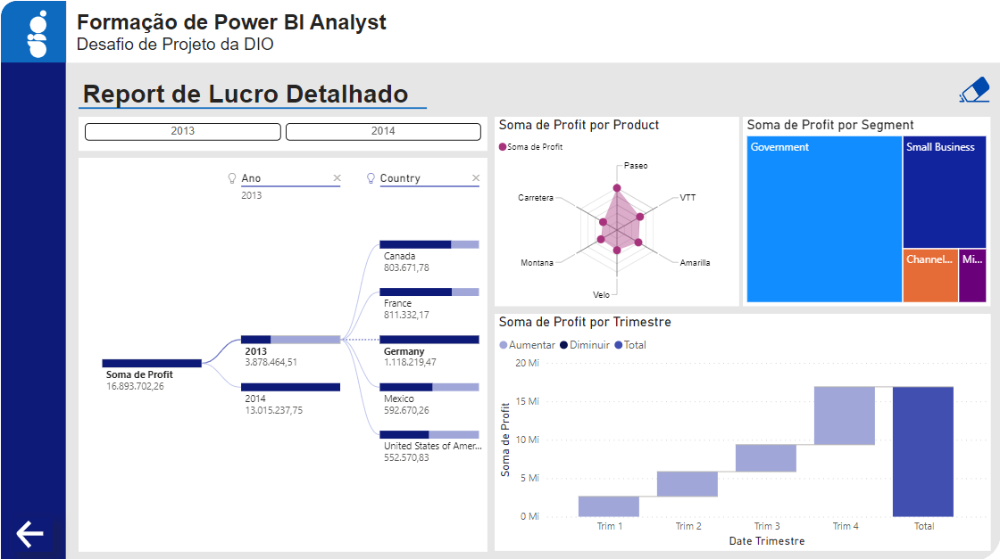

# Relatório de Vendas

Este repositório contém um relatório interativo de vendas desenvolvido através do Power BI. 
O projeto foi elaborado considerando os requisitos do módulo [Criando um Relatório de Vendas Elegante com Power BI](https://web.dio.me/project/criando-um-relatorio-de-vendas-elegante-com-power-bi/learning/a9f091aa-5d5c-40c6-bb91-0aa2b30981c4?back=/track/santander-bootcamp-2023-ciencia-de-dados-com-python&tab=undefined&moduleId=undefined) do curso
[Santander Bootcamp 2023 - Ciência de Dados com Python](https://web.dio.me/track/santander-bootcamp-2023-ciencia-de-dados-com-python) e é constituído pelos relatórios: **Sales Report** (página 1) e **Report de Lucro Detalhado** (página 2).

### Sales Report

---
### Report de Lucro Detalhado

